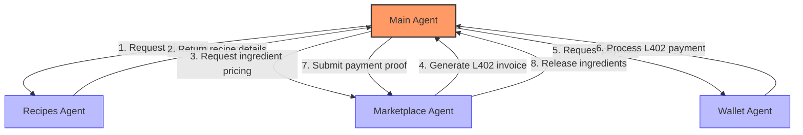
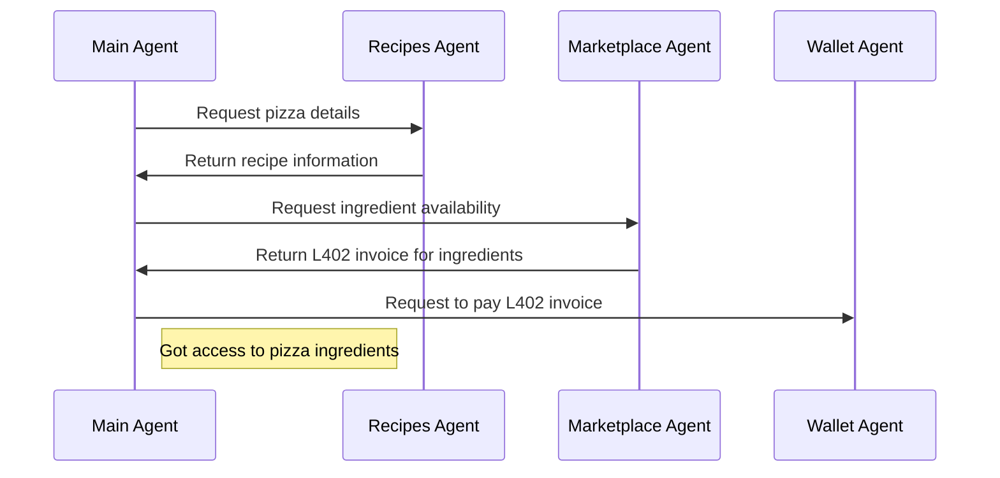

# A2A Payments

A demonstration of L402 payment integration within the Agent-to-Agent (A2A) communication protocol.

## Overview

This project showcases how agents can communicate with each other while incorporating payment mechanisms using the L402 protocol. It demonstrates a multi-agent system where a main agent coordinates with specialized subagents to accomplish tasks, with some interactions requiring payments.

## Architecture

The system consists of a main agent that interacts with three specialized subagents:

### Recipes Agent

- Provides comprehensive information about pizzas
- Contains data on ingredients, prices, and nutritional values
- Acts as an information provider within the agent ecosystem

### Marketplace Agent

- Creates L402 invoices for different ingredients
- Manages pricing and availability of resources
- Requires payment for providing certain resources

### Wallet Agent

- Manages digital assets
- Authenticates and processes L402 payments
- Enables the main agent to pay for services/resources from other agents

## System Diagram

### Payment Flow Sequence

## A2A Communication

This example demonstrates how agents can:

1. Request information and services from each other
2. Create and fulfill payment obligations using L402
3. Coordinate complex tasks requiring multiple specialized capabilities
4. Handle conditional access to information based on payment status

The main agent orchestrates communication between subagents, paying for required services to complete its objectives.

## L402 Integration

The L402 protocol enables conditional access to resources through cryptographic proofs of payment. This demonstration shows how this payment mechanism can be integrated into agent communication workflows.

## Usage

This project serves as a reference implementation for developers looking to incorporate payment mechanisms into their own agent systems. The patterns demonstrated here can be adapted for various agent-based architectures that require payment functionality. 
